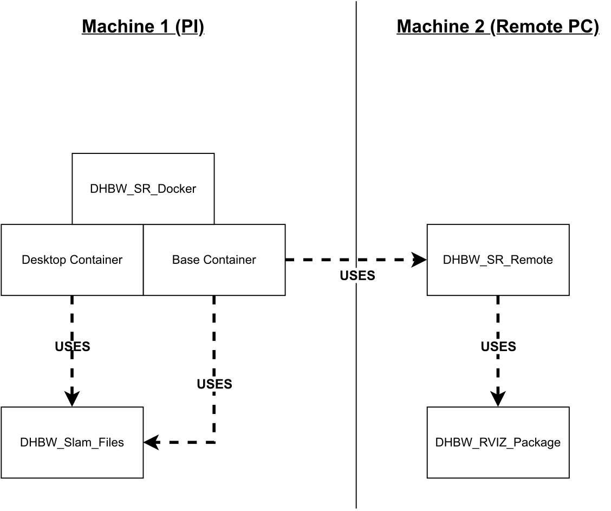

# DHBW Swarmlab Robot - Driving with Lidar

## Manual

### Install the Repository

Navigate trough the terminam to the wanted directory. (e.g. ``cd ~/this/that/here``)
Clone the repository into the directory with ``git clone https://github.com/lschirmbrand/DHBW_SR_Docker``

### Build der Dockerimage

Navigate inside the cloned repository, standard case would be ``cd DHBW_SR_Docker``
After that, start the build, which creates the docker image. This you do by running:
``docker build -t lidar_testing .``

### Running the Dockerimage / Creating the container

First, make sure the lidar was plugged in correctly by typing ``lsusb`` into the terminal. The name of the lidar should be popping up.

After you found the lidar plugged in, run ``sudo chmod 666 /dev/ttyUSB0`` to pass the necessary permisions to the lidar.

The docker container itself doesn't have any graphical display, so you have to pass yours by typing ``xhost +``.
**Notice**: You offer your display to everyone, so you should run ``xhost -`` after you run the container. You can also specify which machine is allowed to access your display.

Now you can finally run the container by typing:
``docker run -it --net=host --device=/dev/ttyUSB0 lschirmbrand/dhbw_navigation_core bash``

This opens a terminal instance of the container. For ROS you need more than one terminal instance, so you have to open more terminals, what you can do by typing:
``docker exec -it name bash``

In every terminal you want to run anything ros-related, you have to first source the directory by typing:
``source devel/setup.bash``
(inside the workspace).

## Layout and Project Structure

To understand the project you might need to understand the different repositories and there combination. The used repositories are linked below:

**DHBW_SR_Docker** (this repository): <https://github.com/lschirmbrand/DHBW_SR_Docker>
**DHBW_SR_Remote:** <https://github.com/lschirmbrand/DHBW_SR_Remote>
**DHBW_Slam_Files:** <https://github.com/lschirmbrand/hector_slam_dhbw> (To be renamed)
**DHBW_RVIZ_Package:** <https://github.com/lschirmbrand/DHBW_rviz_container>

### DHBW_SR_Docker

- Main Repository of the project.
- Contains two different Dockerfiles in the folder [base](https://github.com/lschirmbrand/DHBW_SR_Docker/tree/main/base) and the folder [desktop](https://github.com/lschirmbrand/DHBW_SR_Docker/tree/main/desktop) with different objectives.
  
- #### Base

  - Recommended Dockerfile
  - Every package will be running on the computer of the robot (e.g. raspberry pi) **except** the visualisation (in this case rviz).
  - Therefore the robot works indepent from other machines, but is still using its minimal ressources for the SLAM-Process.
  - To still be able to see the visualisation of the Slam-Process you want to install [DHBW_SR_Remote](https://github.com/lschirmbrand/DHBW_SR_Remote) repository on your second machine (e.g. your main pc). For more information, see below.

- #### Desktop
  
  - Not recommended, doesn't work stable, because of the limited ressources of the robot computer.
  - However, it's still possible. For that just build the Dockerfile in the [desktop](https://github.com/lschirmbrand/DHBW_SR_Docker/tree/main/desktop)-Directory.
  - Note: Only a very basic version of the visualisation can be seen.

### DHBW_SR_Remote

- Used, if you install the [base](https://github.com/lschirmbrand/DHBW_SR_Docker/tree/main/base) version.
- You want to install this ([DHBW_SR_Remote](https://github.com/lschirmbrand/DHBW_SR_Remote)) Repository on your second pc.
- This makes it possible for you to see the process of your robot, rendered on *your* pc. This enables a very advanced version of the visualisation to be executed.
- Also your robot doesn't waste its ressources on rendering (often unneccessary) visualisations.

### DHBW_Slam_Files

- Container of files, which will replace some of the standard files of the libraries
- While the docker build process the old files gets deleted and replaced

### DHBW_RVIZ_Package

- This package enables the visualisation to be more advanced than the basic visualisation.
- Therefore, this package will only be pulled from the [DHBW_SR_Remote](https://github.com/lschirmbrand/DHBW_SR_Remote) Repository on its Build-Process.
